## «Проектирование простого интерфейса средствами Windows Forms: создание программы «Словарь»»

Программа выполнена в среде разработки microsoft visual studio 2017 с помощью Windows Form. Приложение написано для операционной системы Windows. 

Начальный экран программы выглядит следующим образом: 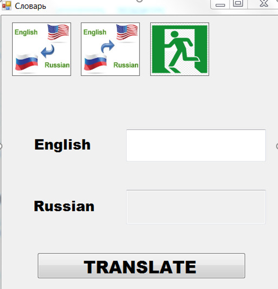

Главный экран представляет из себя окно, содержащее:

* Панель инструментов с тремя кнопками
* Окно ввода (сверху)
* Окно вывода (снизу)
* Кнопка перевода

 

Панель инструментов выражена тремя кнопками. Нажав на первую идет перевод с английского на русский, нажав на вторую идет перевод с русского на английский, а третья - выход из программы.

* En -> Ru; 
* Ru -> En;
* Exit.

 

Программа предоставляет возможность перевода слов с русского на английский язык, и с английского - на русский. 

Переход с английского на русский:

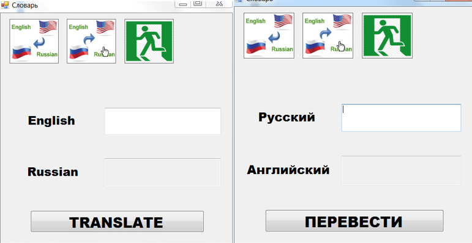

 

Переход с русского на английский:

 

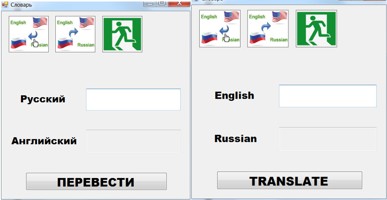

 

Кнопка «Выйти из программы». 

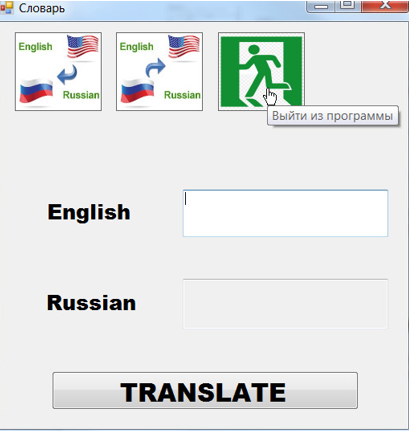

Кстати, в программе также есть tooltips (всплывающие подсказки). При наведении на какой-либо элемент в окне всплывает следующее: 

 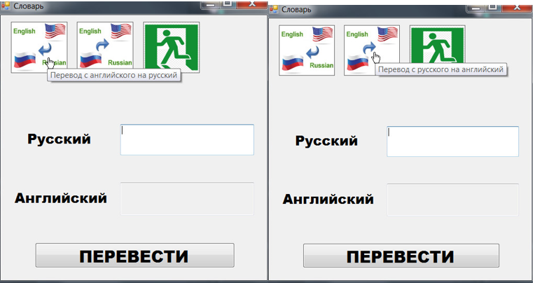

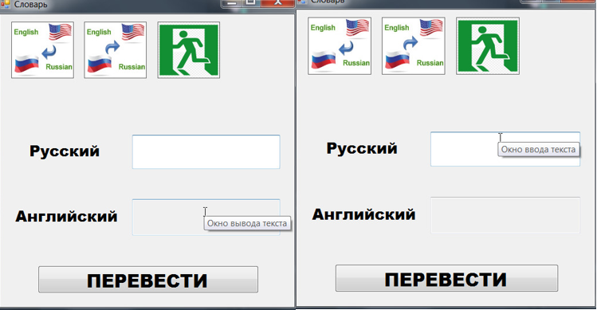

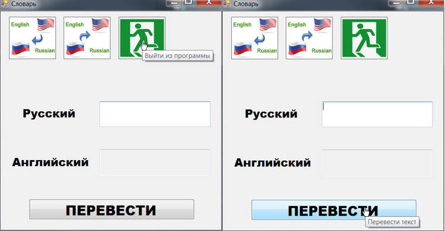

 

В нашем словаре имеются следующие слова:

| car    | машина  |
| ------ | ------- |
| dog    | собака  |
| mother | мама    |
| girl   | девушка |
| father | папа    |
| cat    | кошка   |

 

База слов реализована в файлах EnRuDict.dat  и RuEnDict.dat.

Теперь введем какое-нибудь слово на русском из базы словаря

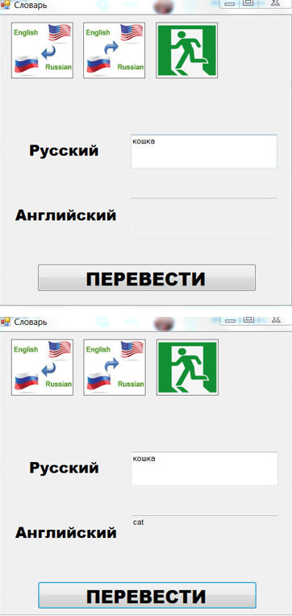

Аналогично для английского:

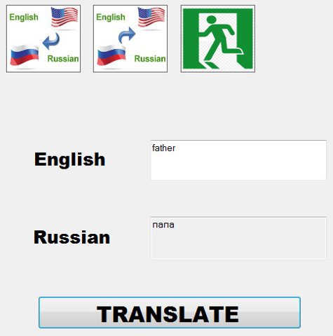

 

Если введенного слова нет в словаре, то программа выдаст:

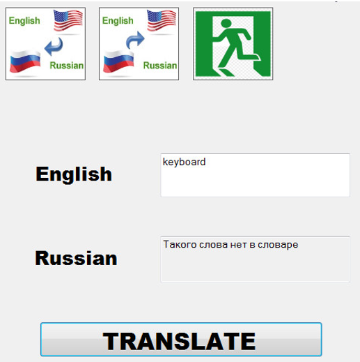

### Приложение

Схема файла OganyanVar2Slovarik

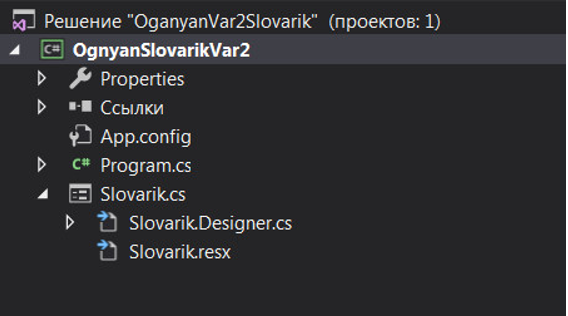