## «Нестандартные элементы управления: создание программы «Ручка управления»»

Программа выполнена в среде разработки microsoft visual studio 2017 с помощью Windows Form. Приложение написано для операционной системы Windows. 

Начальный экран программы выглядит следующим образом:

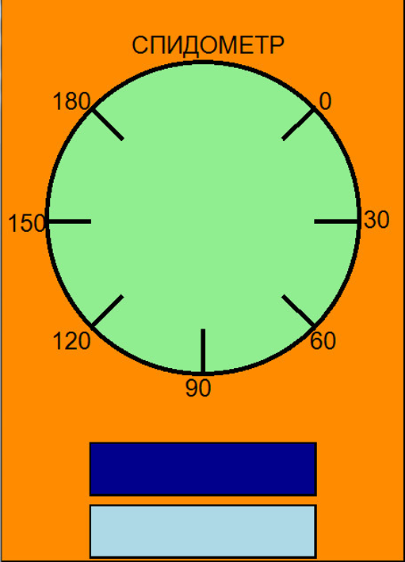

Главный экран представляет из себя окно, содержащее:

* Шкалу спидометра
* Синяя кнопка для включения режима 1
* Голубая кнопка для включения режима 2

 

Режим 1:

Дискретный режим для ступенчатого изменения положения стрелки. Стрелка рисуется строго только к делениям.

Режим 2:

Непрерывный режим для плавного изменения положения стрелки. Стрелка рисуется в любом положении

 

Активируем режим 1.

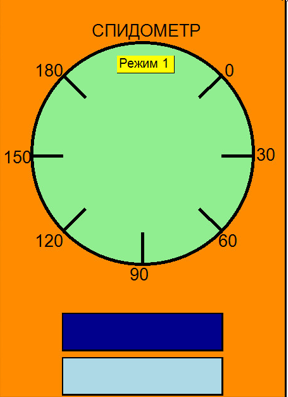

Если кликнуть по примерно такой области около деления, 

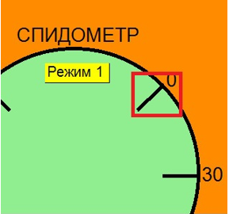

то нарисуется стрелка.

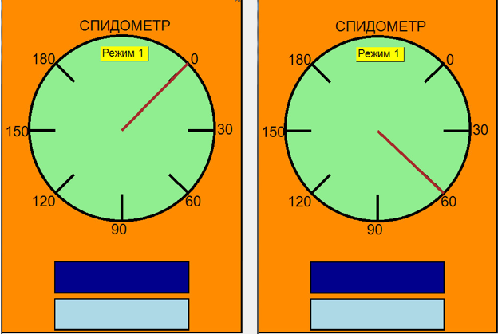

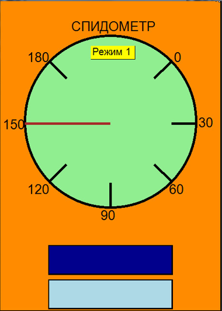

 

Теперь включим второй режим.

### 

 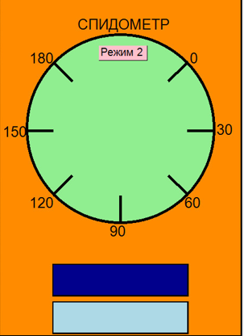

Кликая вдоль границы окружности мы можем построить стрелку в любом месте.

 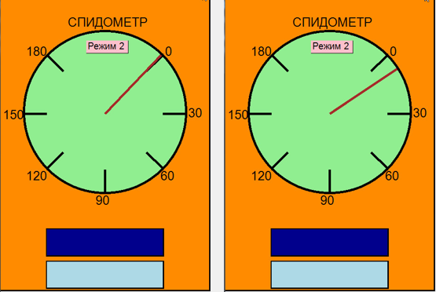

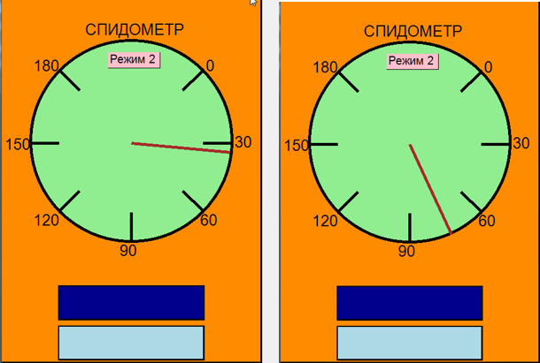

Программа гибкая, то есть при изменении масштаба программа не ломается и выглядит нормально.

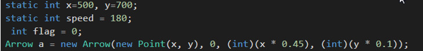

Также можно поменять значения на спидометре, изменив переменную speed.

Например, установим размеры (800,1100) и (900,1160).

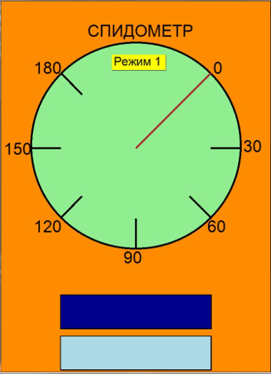

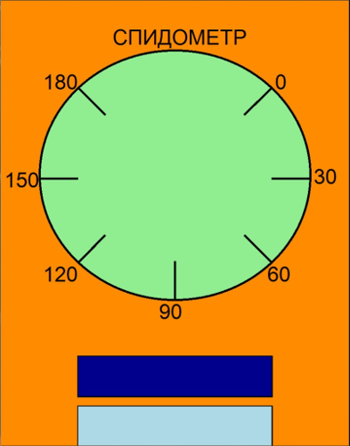

Теперь поменяем speed на 700.

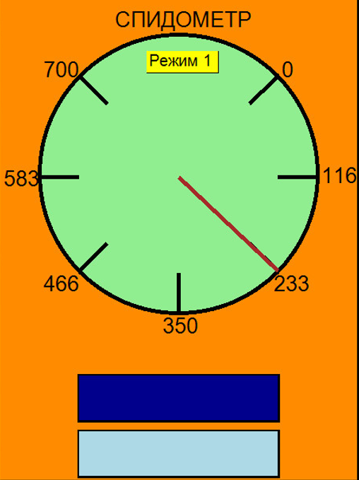

### Приложение

Схема файла OganyanTask2

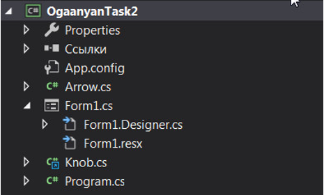

