## «Реализация игры средствами Windows Forms и WPF»

Программа выполнена в среде разработки microsoft visual studio 2017 с помощью Windows Form и WPF (Windows Presentation Foundation**)**. Приложение написано для операционной системы Windows. 

**Суть игры:**

На экране случайным образом с заданным интервалом появляются разноцветные полоски фиксированного размера, которые могут перекрывать друг друга. Поле появления первых N (0.5N) полосок пользователю разрешается убирать их щелчками мышки, причем полоска убирается только если она НЕ перекрыта сверху другими полосками. При убирании всех полосок игра считается выигранной, при появлении 2*N (N) полосок - проигранной.

**Реализация:**

Сам Form.cs и написанный мною класс Rectangles с тремя полями: координата, размер, цвет.

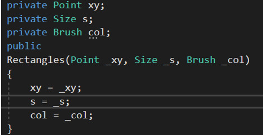

В классе есть 3 метода: 

·    Bool Inside - принимает координаты клика мыши и узнает, попадаем ли мы в прямоугольник

·    Bool Cross - принимает Rectangles и узнает, пересекается ли переданный прямоугольник с текущим

·    Void DrawRec - исходя из полей класса рисует прямоугольник

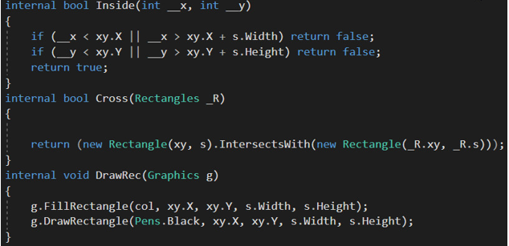

  

Теперь рассмотрим Form.cs:

Часть блока, рандомно генерирующего объект Rectangles выглядит так:

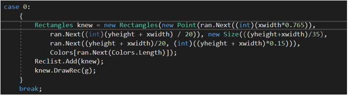

Для сравнения, в WPF это делается иначе. Например, координата задается отступом от всех рамок, а в самом WPF существует свой класс Rectangle, у которого и так есть методы, задающие размер (Height, Width), цвет(Fill), обводку(Stroke). 

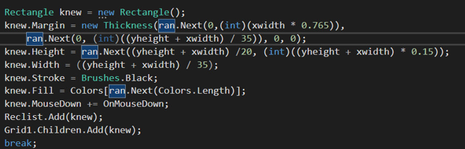

Таймер задается тоже по-разному:

Windows Form:

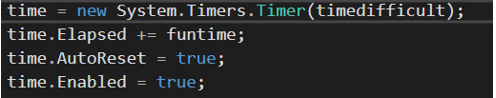

WPF :

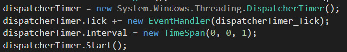

Также WPF сам определяет объект Rectangle,  так что мы просто используем метод IntersectWith, в отличии от Windows Form, где нужно вручную (написанным нами методом) сравнивать элементы массива Reclist по координатам: 

WPF:

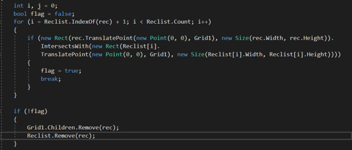

Windows form: 

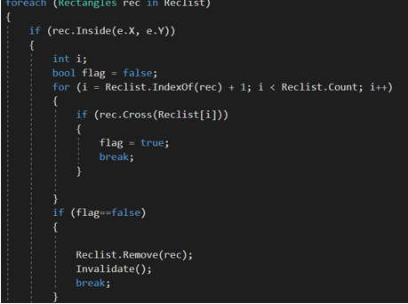

 

В дополнение скажу, что пользователь может регулировать сложность:

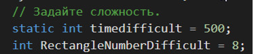

Чем меньше timedifficult, тем меньше задержка, т.е сложнее.

Чем меньше RectangleNumberDifficult, тем меньше порог прямугольников, при котором вы проиграете.

P.s: Задержка 1000 - легко. 500 - нужно попотеть. Если вы выигрываете на <400, то вы сверхчеловек. 

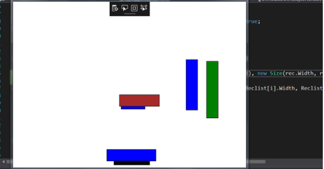

Проигрыш и выигрыш соответственно:

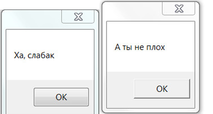

 

**Приложение**

**Windows Forms:**

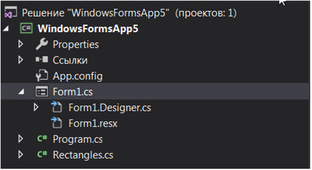