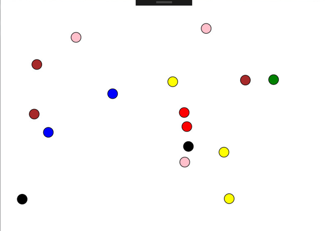
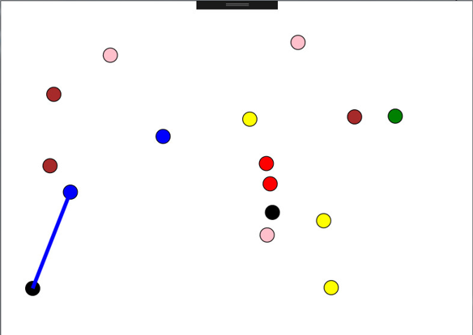
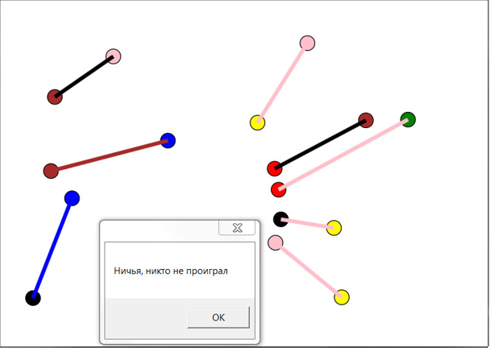
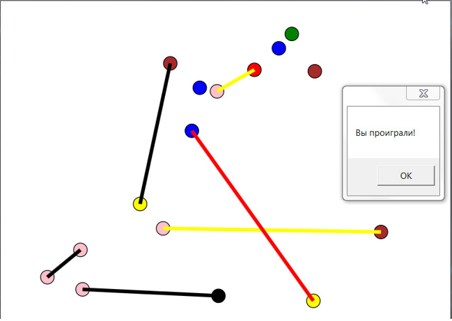
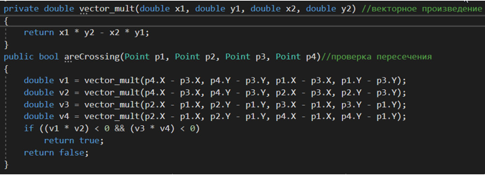
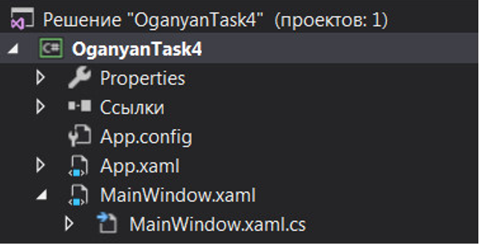

## «Разработка игровых проектов с использованием WPF. Игра «Точки и отрезки»»

Программа выполнена в среде разработки microsoft visual studio 2017 с помощью Windows Form и WPF (Windows Presentation Foundation**)**. Приложение написано для операционной системы Windows. 

 

**Суть игры «Точки и отрезки»**

 

Условия этой игры на бумаге просты: на листе бумаги ставится несколько точек (в нашем случае 16). Играют двое, поочередно соединяя две любые точки отрезком. Захватывать 3-ю точку нельзя, и каждая точка может быть концом лишь одного отрезка. Отрезки не должны пересекаться. Проигрывает тот, кто не сможет сделать ход.

 

 

**Реализация:**

Программа реализована с помощью 4-ех массивов (List):

* Эллипсы
* Координаты эллипсов
* Массив флагов, показывающий есть ли у эллипса данного индекса подведенная к нему линия
* Массив линий между точками

Таким образом, при загрузке программа рандомно генерировала 16 эллипсов и заполняла 1-2 массив, а третий массив, отвечающий за использование/неиспользование точек первоначально был равен 0. 

Начинается игра: при попадании нажатия мышки на эллипс вызывается функция Game, которая, если у этой точки нет смежных отрезков, запоминает ее индекс в массиве. 

Когда мы выбираем вторую такую точку, то сначала рисуется линия и кидается в массив линий.

 А затем с помощью геометрии ( функции areCrossing и вспомогательная vector_mult) считаем, пересекаются ли отрезки. Если нет, то игра продолжается до тех пор, пока не закончатся точки (ничья). Если да - вы проиграли.

 

Реализация методов проверки отрезков на пересечение:

 

### Приложение

Схема файла OganyanTask4

