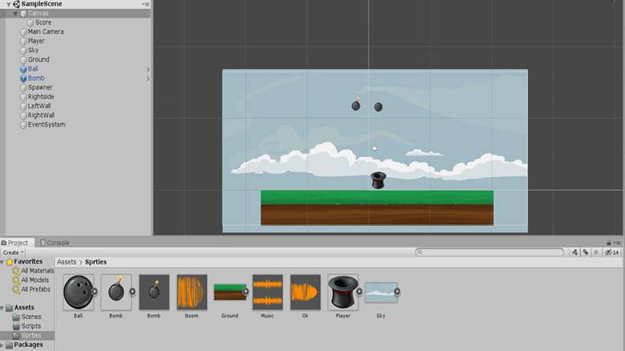
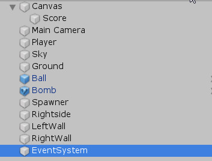
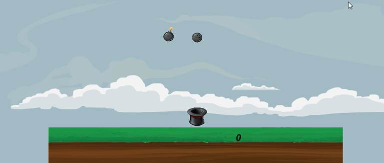
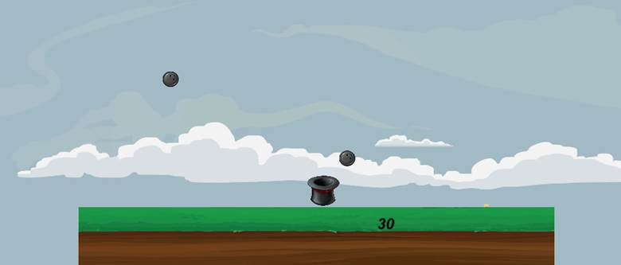
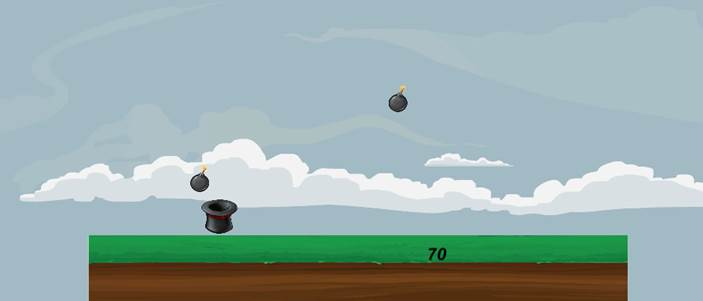
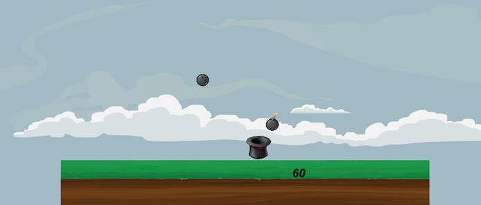
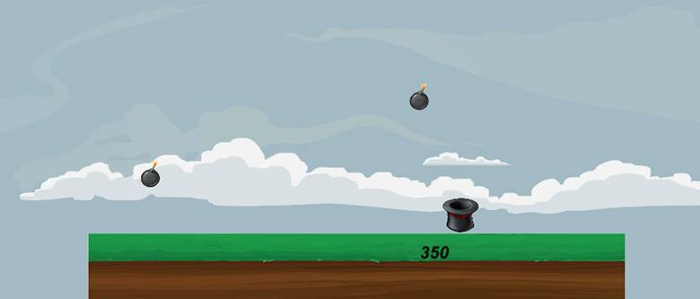
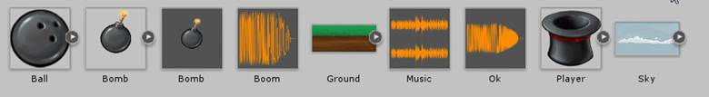

## «Разработка игровых проектов с использованием Unity 2D. Создание игры «Ловилка»»

​     Программа выполнена в среде разработки Unity 2D. Приложение написано для операционной системы Windows.

 

**Суть игры «Ловилка»**

 

На платформе располагается игрок. Он может двигаться влево или вправо до границы платформы. В данной программе игрок выглядит как цилиндр (шляпа). С неба падают 2 вида объектов: бомбы и шары. Наша задача поймать как можно больше шаров и как можно меньше бомб. За каждый пойманный шар мы получаем 10 очков, за бомбу - минус 10. Ваш счет написан справа от центра платформы. Программа сопровождается музыкой, при поимке шара идет «удачный звук», при поимке бомбы - «неудачный».

 

**Реализация:**

Так выглядит рабочая среда программы.

 

Объекты в данной программе:

Score - текст, показывающий ваш счет

Player - цилиндр

Sky - небо

Ground - платформа

Ball - шары, постоянно появляющиеся рандомно

Bomb - бомбы, постоянно появляющиеся рандомно

Spawner и RightSide - места, между которыми появляются шары и бомбы

LeftWall и RightWall - левая и правая границы, за которые не может зайти игрок

Спрайты и скрипты см в **Приложении**.

 

Начало игры:

Ловим шар и получаем +10 ( теперь у нас станет 40).

Ловим бомбу и получаем -10 ( станет 60)

 

Игра не очень замысловатая. В моей модификации объекты падают быстро, но цилиндр двигается тоже быстро. Набил 350 очков и вспомнил, что пора делать Task6.

### Приложение

Спрайты:

 

Скрипты:

 

**itemChecker****:** скрипт проверяет, поймали ли мы шар/бомбу.  Отвечает за ваш счет и за звук.

**itemSpawn:** скрипт рисует шары/бомбы на одной высоте с рандомно выбранной первой координатой

**PlayerMove****:** скрипт отвечает за движение цилиндра влево-вправо

**timeDestroyer:** скрипт удаляет объекты из сцены 